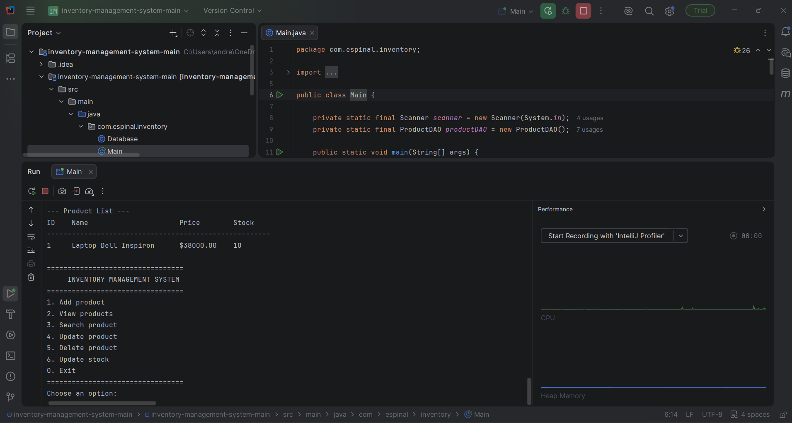

# Inventory Management System

A console-based inventory management system developed with Java, SQLite, JDBC, and Maven.

## Overview

This project is designed to manage products through a simple command-line interface.

The application allows users to:

- Add products
- View all products
- Search products by ID
- Update product information
- Delete products
- Update product stock
- Store data persistently using SQLite

## Technologies

- Java 17
- SQLite
- JDBC
- Maven
- SQL
- Object-Oriented Programming (OOP)

## Project Structure

```text
src/
└── main/
    ├── java/
    │   └── com/
    │       └── espinal/
    │           └── inventory/
    │               ├── Database.java
    │               ├── Main.java
    │               ├── Product.java
    │               └── ProductDAO.java
    │
    └── resources/
        └── database.sql

pom.xml
README.md
```

## Database

The application uses SQLite to store product information persistently.

The `products` table contains:

| Field | Type | Description |
|---|---|---|
| id | INTEGER | Unique product identifier |
| name | TEXT | Product name |
| price | REAL | Product price |
| stock | INTEGER | Available quantity |

## How to Run

### Requirements

- Java JDK 17 or later
- Maven

### Run with Maven

```bash
mvn compile
mvn exec:java
```

## Preview

<p align="center">
  
</p>

## Main Features

The system implements the main CRUD operations:

- **Create:** Add new products to the inventory.
- **Read:** View all products and search by ID.
- **Update:** Modify product information and stock.
- **Delete:** Remove products from the database.

## Example

```text
=================================
     INVENTORY MANAGEMENT SYSTEM
=================================
1. Add product
2. View products
3. Search product
4. Update product
5. Delete product
6. Update stock
0. Exit
=================================
Choose an option:
```

## Learning Objectives

This project demonstrates practical knowledge of:

- Java programming
- Object-Oriented Programming
- CRUD operations
- SQL databases
- JDBC database connectivity
- SQLite data persistence
- Exception handling
- Input validation
- Maven project management

## Author

**Andrés Espinal**

GitHub: https://github.com/Espinal-27
Portfolio project developed as part of my software development learning journey.
